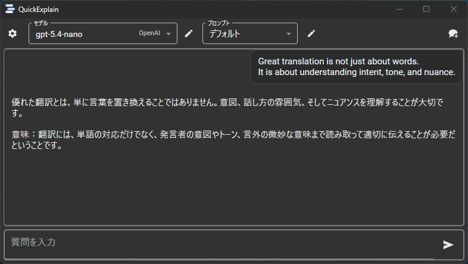
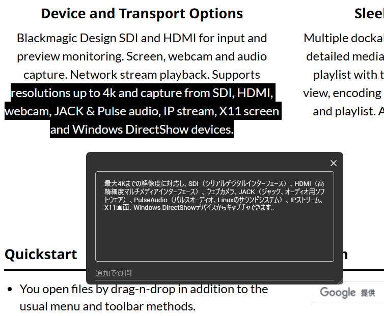
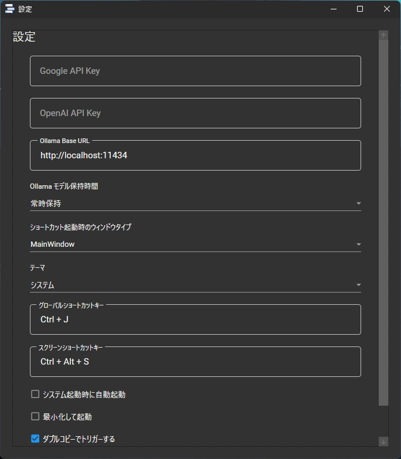

# QuickExplain

Windows向けの翻訳・Q&Aツール

## 概要
**QuickExplain** は、WPF/.NET 8 で開発されたWindows用アプリケーションです。 
選択テキストを `Ctrl + C + C` で即時に翻訳し、結果を確認できます。 
Google / OpenAI のAPI、またはOllamaのローカルLLMを利用し、プロンプトをカスタマイズしながら翻訳や質問応答が可能です。

## 主な機能
- **ダブルコピーで即時翻訳**  
  選択テキストを `Ctrl + C + C` で翻訳ウィンドウを表示
- **グローバルショートカット**  
  任意のショートカットで選択テキストを翻訳（設定で変更可能）
- **スクリーンショットで質問**  
  画面範囲を選択して画像をAIに送信（Google / OpenAI 対応）
- **モデル編集・切り替え**
  Google / OpenAI / Ollama の利用可能モデルを取得し、使用するモデルを追加・削除・切り替え
- **Ollama対応**
  ローカルで起動しているOllamaのモデルを追加して利用可能
- **プロンプト管理**  
  複数のプロンプトを作成・編集・切り替え
- **チャットUI**  
  これまでの質問と回答を一覧で確認
- **テーマ切り替え**  
  ダーク / ライト / システムに対応
- **タスクトレイ常駐**  
  処理中・完了・失敗の状態をアイコンで表示
- **起動オプション**  
  システム起動時の自動起動、最小化起動に対応

## 動作環境
- Windows 10 / 11
- .NET 8.0
- Google APIキー（Google Geminiモデル利用時）
- OpenAI APIキー（OpenAIモデル利用時）
- Ollama（ローカルLLM利用時）

## インストール
1. [リリースページ](https://github.com/Rinqer0203/QuickExplain/releases)から `QuickExplain.exe` をダウンロード
2. `QuickExplain.exe` を実行
3. 設定画面でAPIキーやOllamaの接続先を登録

## 設定
- **Google API Key**
  Google Geminiモデルを利用する場合に設定
- **OpenAI API Key**
  OpenAIモデルを利用する場合に設定
- **Ollama Base URL**
  Ollama利用時の接続先。通常は `http://localhost:11434`
- **Ollama モデル保持時間**
  Ollamaモデルをリクエスト後にどの程度メモリ上へ保持するかを設定
- **モデル編集**
  利用可能なモデルを取得し、使いたいモデルだけを追加。不要なモデルは削除可能

Ollamaのモデルはデフォルトでは追加されません。Ollamaを起動した状態でモデル編集を開き、表示されたローカルモデルを追加すると利用できます。

## 使い方
1. 翻訳したいテキストを選択
2. `Ctrl + C + C` を押す
3. ウィンドウに翻訳結果が表示される
4. 必要に応じて追加質問を入力してAIに質問

## デフォルトショートカット
- 即時翻訳（選択テキスト）: `Ctrl + J`
- スクリーンショット質問: `Ctrl + Alt + S`

※ ショートカットは設定画面から変更できます。

## ライセンス
MIT License
